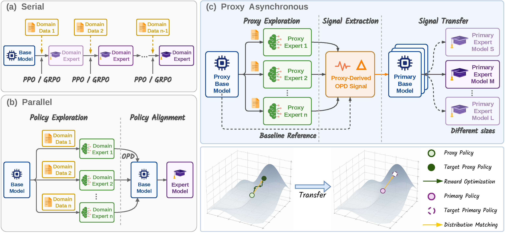
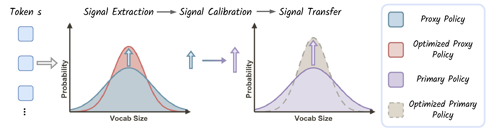
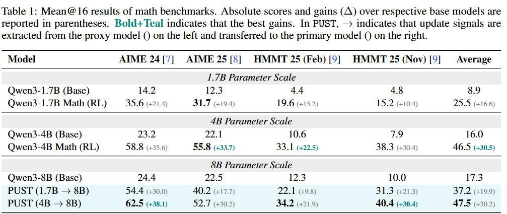
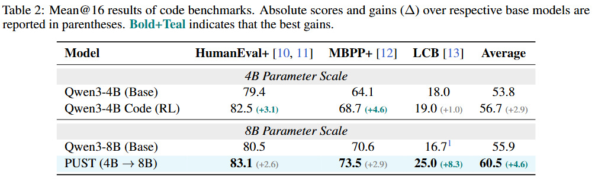
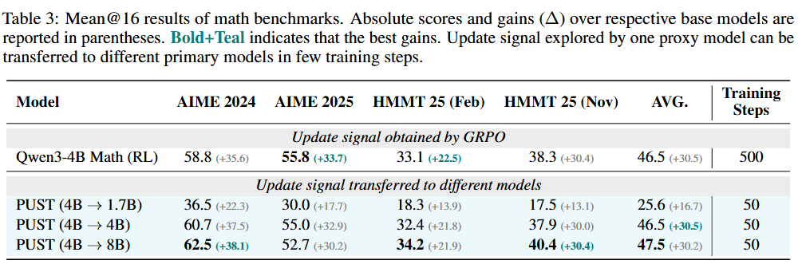
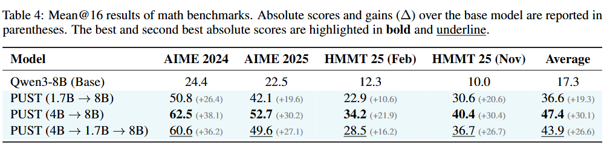
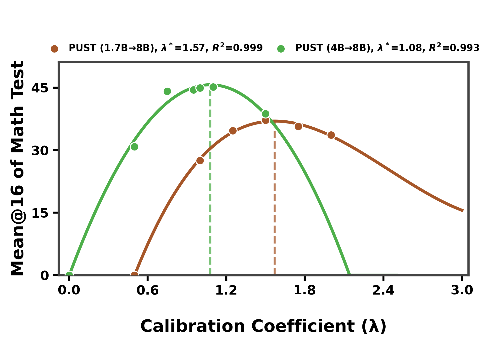

  <h1 align="center">PUST</h1>
  <h3 align="center">Proxy-Guided Update Signal Transfer for LLM Post-Training</h3>
  

    
  

  

> 💡 PUST decouples LLM post-training into **proxy exploration** → **update-signal extraction** → **signal transfer**. A lightweight proxy performs low-cost trial-and-error, while the primary model aligns to relative improvement signals.

  
   <b>Figure 1.</b> Comparison of post-training pipelines. (a) Serial: Sequential domain exploration, risking catastrophic forgetting. (b) Parallel: Parallel domain exploration followed by unified policy alignment. (c) Proxy Asynchronous (Ours): A proxy model conducts asynchronous exploration; extracted signals are subsequently transferred to various primary models. Decoupling these update signals from the base model enables seamless propagation and reuse. 

## ⚙️ Method

  
   <b>Figure 3.</b> Overview of PUST.

PUST extracts the relative improvement between the initial and optimized proxy policies:

$$\Delta_\phi(a \mid s_t) = \log \frac{\pi_\phi^+(a \mid s_t)}{\pi_\phi(a \mid s_t)}$$

The primary model's absorbed update is measured relative to its frozen anchor:

$$\Delta_\theta(a \mid s_t) = \log \frac{\pi_\theta(a \mid s_t)}{\pi_{\mathrm{ref}}(a \mid s_t)}$$

The calibration coefficient $\lambda$ prevents the primary model from repeatedly over-applying a static proxy signal:

$$r_\lambda(a \mid s_t) = \Delta_\phi(a \mid s_t) - \lambda  \Delta_\theta(a \mid s_t)$$

The primary model is optimized with:

$$\mathcal{L}_{\mathrm{proxy}}(\theta) = -\mathbb{E}_{s_t \sim \mathcal{D}} \left[ \sum_{a \in \mathcal{V}} \pi_\theta(a \mid s_t) \left( \log \frac{\pi_\phi^+(a \mid s_t)}{\pi_\phi(a \mid s_t)} - \lambda \log \frac{\pi_\theta(a \mid s_t)}{\pi_{\mathrm{ref}}(a \mid s_t)} \right) \right]$$

Here $\pi_\phi$, $\pi_\phi^+$, and $\pi_{\mathrm{ref}}$ are frozen; only $\pi_\theta$ is updated. A larger $\lambda$ yields more conservative transfer.

## 📊 Results

Evaluated with Qwen3 models on DeepMath-103K (math) and Eurus-RL-Code (code):

- **Weak-to-strong transfer:** 1.7B / 4B proxy signals improve an 8B primary model.
- **Reusable signals:** the same signal transfers to primary models at different scales in 50 steps.
- **Multi-hop transfer:** signals remain useful across sequences such as 4B → 1.7B → 8B.

  
   <b>Table 1.</b> Math benchmarks (Mean@16).

  
   <b>Table 2.</b> Code benchmarks (Mean@16).

  
   <b>Table 3.</b> Reusability of proxy update signals.

  
   <b>Table 4.</b> Transitivity of proxy update signals.

  
   <b>Figure 4.</b> Sensitivity to proxy model and calibration coefficient λ.

Performance peaks at $\lambda^* \approx 1.51$ for the 1.7B proxy and $\lambda^* \approx 1.08$ for the 4B proxy. Both optima exceed 1.0, indicating that proxy signals should be down-scaled to avoid over-updating; the stronger 4B proxy also achieves a higher peak.

## 📦 Model Weights

Pre-trained GRPO checkpoints are available on <a href="https://huggingface.co/KnowledgeXLab/PUST-Experiments"> <b>Hugging Face</b></a>.

| Checkpoint | Role | Training |
|:--|:--|:--|
| [`Qwen3-1.7B-Math-GRPO-Steps500`](https://huggingface.co/KnowledgeXLab/PUST-Experiments/tree/main/Qwen3-1.7B-Math-GRPO-Steps500) | Proxy | DeepMath-103K · GRPO · 500 steps |
| [`Qwen3-1.7B-Math-GRPO-Steps800`](https://huggingface.co/KnowledgeXLab/PUST-Experiments/tree/main/Qwen3-1.7B-Math-GRPO-Steps800) | Proxy | DeepMath-103K · GRPO · 800 steps |
| [`Qwen3-8B-Math-GRPO-Steps400`](https://huggingface.co/KnowledgeXLab/PUST-Experiments/tree/main/Qwen3-8B-Math-GRPO-Steps400) | Primary | DeepMath-103K · GRPO · 400 steps |

## 🙏 Acknowledgement

Our training and evaluation code builds upon the following open-source projects:

- <a href="https://github.com/RUCBM/G-OPD"><b><u>G-OPD</u></b></a> — Generalized On-Policy Distillation framework for post-training and evaluation
- <a href="https://github.com/volcengine/verl"><b><u>verl</u></b></a> — Volcano Engine Reinforcement Learning framework for LLMs (the base of G-OPD)

> 🚀 **Code release:** coming soon.
